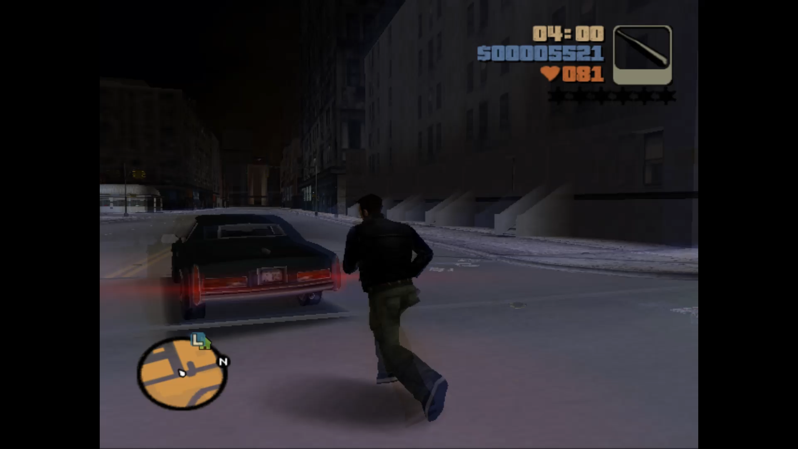
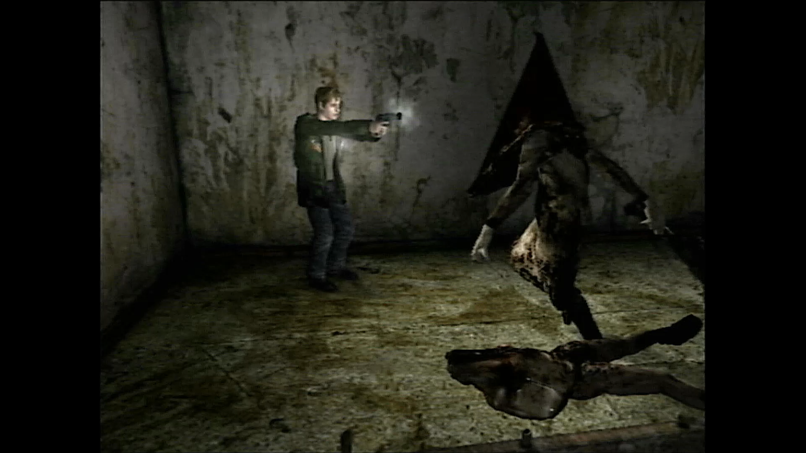
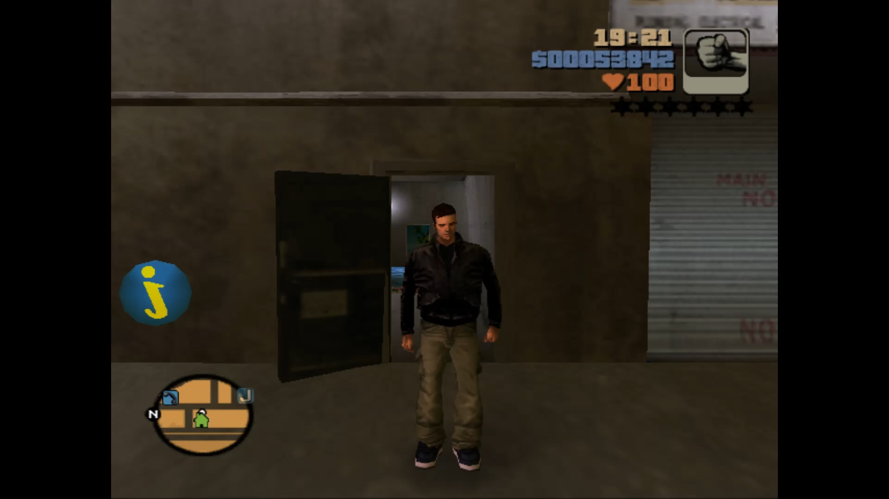
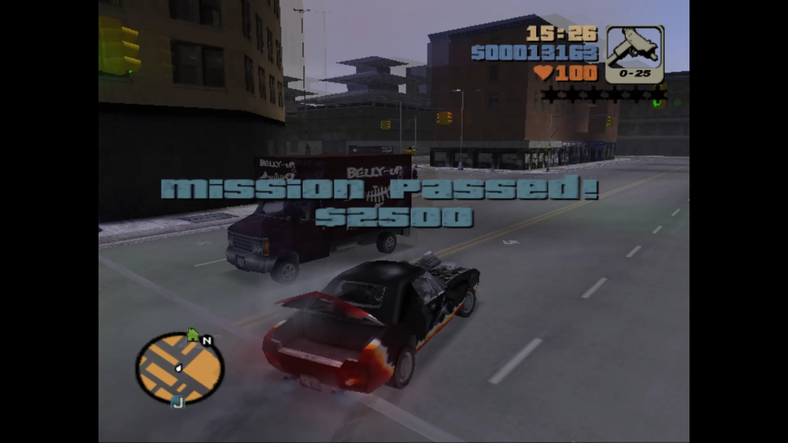

# Native PS2 look with modern features

*PCSX2 screenshot*

My goal with this setup was to recreate a native PS2 look. More specifically, I didn’t want the image to look too sharp or upscaled. I wanted to feel as though I was playing the game on original hardware but also be able to use a PS5 controller and not worry about cable management. PCSX2 does just about that by default, which is great.

# Why not use original hardware?

*PS2 screenshot*

I own a PS2 console and have the capability to capture footage, but my cheap AV2HDMI upscaler and USB capture card do a poor job of converting the signal. Even when sharpened in OBS, it doesn’t look good. There’s also the issue of switching between OBS and the console with my one monitor setup. I can see a preview in OBS but there is a risk of input delay. It is possible that I could upgrade my setup but for now this software is a good option.

# PCSX2 advantages

*PCSX2 screenshot*

The advantage of using PCSX2 is that you can use a PS5 controller via USB. You can also monitor OBS as you play without needing to switch to another HDMI input. Crucially, the emulator is set by default to recreate a PS2 look without needing too many tweaks. However, there are a couple of settings that I want to mention.

# Audio lag issue: Solved

*PCSX2 screenshot*

I encountered a problem where the audio lagged very noticeably as the game loaded. I fixed the issue by setting the graphics API to Direct3D 11. By default, the graphics API is set to automatic. I can only assume that the emulator was opting for a graphics renderer that put too much strain on my PC. If you encounter any lag this might be worth checking.

---

*Note - I own a PS2 console and physical copies of the games featured in this article. I do not endorse piracy. If you would also like to emulate games you have legitimate access to you can find the PCSX2 emulator [here](https://pcsx2.net/)*
