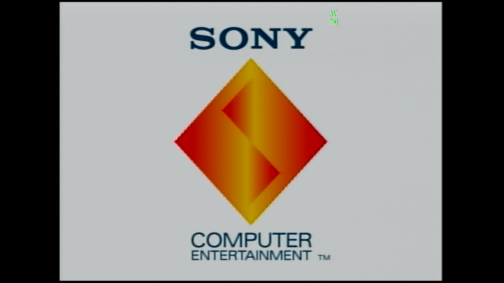

# Overview

I recently posted [an article on the PCSX2 emulator](pcsx2.md) and explained why, in some circumstances, I found it more appealing than recording on original hardware. For balance, I thought it might be cool to run through my retro console setup for capturing footage on PC, listing some of the pros and cons.

# My setup (PS1 hardware)

### AV Composite cable to HDMI converter

The red, yellow and white pins go into the AV2HDMI converter and you connect a HDMI cable on the other end. This converts the analogue signal into digital.

### HDMI splitter to (1) TV and (2) PC

This is another handy tool that splits the converted signal.

### USB capture card

One of the HDMI outputs from the splitter goes into the capture card, which is connected to the PC. This allows me to capture the video output in OBS.

# The pros

I think the main reason to record on original hardware is for authenticity. An emulator can mimic the image at native resolution but it cannot recreate the actual tactile feedback of interacting with peripherals (memory cards, for example) and the console itself. Inserting the disc, booting up the console and hearing the sound of the system running the game is an important aspect of the retro gaming experience. 

I also believe that there is something radical about not ditching your old tech in a world that encourages you to keep buying new things.

# The cons

The downside to capturing footage from a retro console is the video quality. I have a cheap upscaler and capture card from Amazon, so my setup is not ideal. The image can appear very pixelated. However, it serves its purpose. I might consider buying a [fancy upscaler](https://www.retrotink.com/shop/retrotink-2x-pro) for more advanced video processing at some point.

The other inconvenience is cable management. For this setup, I required two converters, 2x USB ports to power the converters, 3x HDMI cables and a USB port on my PC for the capture card.

